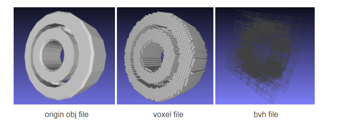

# Positon based dynamic with taichi

- The code implements one of nvidia's paper [PBD](https://mmacklin.com/uppfrta_preprint.pdf)

- The code uses [Taichi](https://github.com/taichi-dev/taichi) programming language

---

## How to run 

- First config your anaconda workspace, and open the anaconda prompt
  
- Second you need to install dependency  
  ```python
  pip install -r requirements.txt
  ```

- Last you type 
  ```python
  ti Example.py
  ```

---

## How to generate voxel file

- First copy your obj file to "model" , for example "Bearings.obj"
  
- Second you need to modify the code in GenVoxel.py
  ```python
  obj_name = "Bearings"
  ```

- Then you type 
  ```python
  ti GenVoxel.py
  ```

- Last you will get a voxel file like below:




## Some example

- Rigidbody Simulation
- Red particle means it contact ground plane, green means it has at least one neighbour from other rigidbody 


